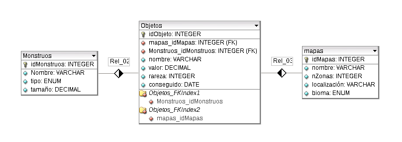

# Proyecto python BD
Sobre la siguiente base de datos:

Realiza las siguientes actividades:
1. **Listar información**: Lista los mapas y el total de zonas que tiene cada uno.
2. **Buscar o filtrar información**: Muestra los monstruos que empiecen por una subcadena.
3. **Buscar información relacionada**: Pide por teclado un monstruo y muestra los objetos que suelta al morir.
4. **Insertar información**: Inserta un nuevo monstruo en la tabla Monstruos.
5. **Borrar información**: Borra los objetos de un monstruo indicado por teclado
6. **Actualizar información**: aumenta el valor de los objetos un porcentaje indicado por teclado.
